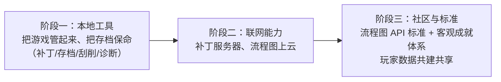

# Galbox 开发初衷复原报告

> 复原时间：2026-09-11
> 复原对象：`E:\tmp\Galbox_v2`（以及它的前身 `E:\tmp\Galbox`，2026-04-12 ~ 2026-04-28 期间开发）
> 复原方式：从消失的 Claude Code 会话痕迹中反向重建（见文末「证据清单」）

---

## 〇、先说结论：你当初想要的东西是什么

一句话：

> **你想做一个「Galgame 玩家的游玩伴侣」，而不是又一个游戏启动器。**

它要替玩家吞掉 Galgame 这个圈子特有的、巨麻烦的四件事——**找汉化补丁、管存档、认引擎、修环境（转区/解码器/中文路径）**，并且用两个别人没做过的东西拉开差距：**存档剧情节点标记** 和 **流程图追踪**。最终目标不是做一个本地小工具，而是**给整个 Galgame 社区定一套标准（流程图 API 标准 + 客观成就体系），让玩家和社区一起共建**。

---

## 一、你是谁——你自己的定位

你在 2026-04-13 22:03 亲口说过（原文，直接从 Claude Code 的输入历史里捞出来的）：

> 说的这些其实我都不知道，因为我根本就不是专业的技术人员，我只是一个普通的玩家爱好者，没有太多的技术背景。
> 所以在之后的所有问题回答里，你也不用让我去太深入技术上的引导思考和判断，我希望你推荐你认为最合理、最好的方案，就可以了。
> 你让我说，我也说不出来七七八八。

这句话决定了整个项目的合作方式，也决定了你后面所有的产品决策风格：

- **你是需求方 + 审美/体验裁判，不是实现者。** 你反复强调「你作为主窗口只负责推进项目、编排创建各 agent」，写代码、review、修复都不许主窗口自己动手。
- **你只对「产品判断」拍板，对技术选型放手。** 「存档引擎适配策略你推荐选什么就选什么，然后以上所有建议接受全部」。
- **但你对产品边界极其强硬。** 一旦触到你觉得"这样就没意义了"的地方，你会直接推翻 AI 的方案（见第四节）。

---

## 二、你要解决的痛点（原始需求）

从你写的那份 `need.md` 草稿（4-13 粘贴了 159 行给 BMAD，文件后来被你亲手删掉）往下延伸出来的 PRD，痛点是这样被记录下来的：

| 痛点 | 玩家的真实处境 | Galbox 的解法 |
|------|---------------|--------------|
| **补丁地狱** | 汉化补丁、修复补丁、18+补丁散落在 moyu.moe、贴吧、网盘，版本对不上，装错了覆盖不回来 | 补丁中心：自动匹配 + 一键下载 + 解压覆盖 + 覆盖前自动备份 |
| **存档焦虑** | 存档在哪？哪些存档是哪条线的？换台机器/重装就没了 | 存档管理：自动识别位置 + 存档节点命名 + 时间线视图 + 分支分组 + 快照 |
| **引擎不认** | 每个引擎（Ren'Py / KiriKiri / Tyrano / VNS…）存档格式、位置全不一样 | 引擎适配层，逐个引擎啃（你亲自点名要加 tyrano） |
| **环境折腾** | 中文路径乱码、要转区、缺 DirectX、缺 K-Lite 视频解码器 | 游戏健康诊断：一键检测 + 一键修复建议 |
| **找不回游戏资料** | 中文名、封面、简介、角色、标签到处找 | 四源刮削：Bangumi / VNDB / ymgal / cngal，90% 相似度自动采用 |

这些不是技术问题，是**一个 Galgame 玩家十年积累下来的具体烦躁**——你把它们一条条写进了 `need.md`，并且特别交代：

> 我再补充一点，就是尽量还是把 need.md 里面，这个文件里面所写的所有的需求最后都做出来比较好，**只要多不能少**。

---

## 三、产品定义与定位（PRD 原文）

你的 PRD 里，产品定位那一栏写的是这句话，加粗的：

> **「Galbox 是玩家的游玩伴侣，不只是游戏启动器」**

目标用户你自己分了三类：

| 用户类型 | 特征 | 核心需求 |
|---------|------|---------|
| 核心玩家 | 拥有 50+ Galgame | 快速启动、存档管理、补丁整合 |
| 收藏玩家 | 收集大量但没全玩 | 游戏库分类、待玩列表 |
| 新手玩家 | 刚接触 | 健康诊断、补丁安装指导 |

竞品只认了一个：**PotatoVN**。你的差异点写得很清楚——它有游戏库和基础存档备份，**而你有存档节点标记、补丁一键整合、流程图追踪**。

功能优先级你自己定的，很有信息量：

| 优先级 | 模块 | 你的判断 |
|-------|------|---------|
| **P0** | 存档管理 | 第一版核心 |
| **P0** | 补丁下载整合 | 第一版核心 |
| P1 | 游戏库管理 / 快速启动 / 健康诊断 / 进程监控 | 第一版核心 |
| **P2** | 流程图追踪、社区成就系统 | **第一版只预留接口，前端隐藏** |
| P3 | 音乐/视频媒体库、成就分享卡片 | 后续版本 |

**P0 是「存档」和「补丁」，不是「游戏库」。** 这是你和其他"游戏管理器"最根本的分歧：别人做的是书柜（把游戏摆整齐），你要做的是**玩的过程本身**（帮你装补丁、帮你保命、帮你记住你走到哪了）。

---

## 四、你对产品的关键思考（原话 + 解读）

### 4.1 你不接受"假的"功能

关于成就系统，AI 给的方案里包含"玩家手动申报成就"。你直接驳回：

> 同意，不过就修改一点，**成就系统的话还是不让玩家自己手动申报，这样的话没有什么意义了**。流程图的话是以远程 API 服务为主，这样的话定下来一套确定的 API 标准，形成一个统一的主流的几个流程图标准的话，然后使用通用的 API 也方便以后社区的共建；**成就系统的话，就以存档解析推断和进程内存监控两个为主**

解读：你要的是**客观可验证**的成就——从存档数据反推、从进程内存监控推断。手动申报=自欺欺人，你宁可不做也不做假的。这条认知很硬核。

### 4.2 你要"标准"，不只是功能

> 流程图的话是以远程 API 服务为主，这样的话**定下来一套确定的 API 标准**，形成一个统一的主流的几个流程图标准的话，然后**使用通用的 API 也方便以后社区的共建**

解读：流程图追踪对你不是一个小功能，是一件**基础设施**——你希望有一份 Galgame 通用的"剧情分支图"数据规范，别人也来贡献，而不是你自己闭门造一个。你甚至想过用自己已有的 VPS 来跑这个服务。

### 4.3 你对圈子的现实非常清楚

当 AI 在纠结各种边界情况时，你一句话把讨论按住了：

> 绝大多数问题都不用考虑，都不存在。我再额外说几点：
> 1. 关于 8，**几乎所有的补丁安装都是直接解压并且覆盖**，很少有其他的方法
> 2. 关于 9，你就直接用 **VNDB、ymgal、cngal、bangumi 进行刮削，肯定能成，别想那么多**
> 3. 我再补充一点，关于兼容的存档兼容引擎的话，**再加一个 tyrano**
> 现在直接进行下一步吧，不需要逐项验证或调整决策

解读：这就是**领域专家**的判断力——你说不出技术方案，但你清楚这个圈子的实际生态（补丁就是覆盖、这四个站就是数据源、Tyrano 不能漏）。这是任何 AI 都替代不了的部分，也是这个项目真正的护城河。

### 4.4 你要求是"本地原生应用"，不是网页

第一版（`E:\tmp\Galbox`）被做成了套壳 Web（localhost:1420），你测完直接炸了：

> 意思是你做的是一个网页啊？**我寻思你做的是一个本地 APP 应用呢。** 还有你这做的逻辑真是一坨大便呐，怎么扫描文件夹都扫不出来啊？
> 最重要的，你让我选择文件夹，然后在给定的文件路径里面去扫描。但是**你没有提供让我自己选择文件路径的那个地方**啊？还有一件事是，整个应用就是我在浏览器的 localhost 的 1420 端口看到的，**它并没有弹出一个本地的、脱离浏览器的窗口**呀

解读：这一顿骂直接导致 v1 废弃、`Galbox_v2` 用 WinUI 3 重写。你要的体感是**桌面软件**：有原生窗口、能选目录、能真的扫到东西——而不是一个跑在浏览器里的壳。

### 4.5 你要的是"真测试"，不是"编译通过"

> 总之是一堆 bug，**应该自行实现实际的检测，而不是仅仅做编译通过的检测**。请自行完成整个流程。我已经在电脑里提供了两个游戏的路径，你可以用它们测试一下。`D:\GAME\Dreamin'_Her` 和 `D:\GAME\SabbatOfTheWitch`

解读：你把自己电脑上真实在玩的两个 Galgame（《魔女的夜宴》SabbatOfTheWitch、《我梦见了她》Dreamin'_Her）交出来当测试样本。"编译通过"在你这里不算交付。

### 4.6 语言：中文优先，且要"完善"

> 还有就是**软件需要支持所有主要语言、特别是要有完善的简体中文**

解读：一个中文圈玩家做给中文圈玩家的软件，你却要求 i18n 架构上支持所有主要语言，但简体中文必须是第一等的——既要有国际化野心，又不能把母语体验做成翻译腔。

---

## 五、你要它长成什么样（三阶段野心）

从 PRD 的功能优先级和那句"第一版预留接口、前端隐藏"能看出你清晰的路线图：

- **第一版（交付）**：一个**能用的本地 Windows 桌面软件**——扫描、刮削、存档备份/切换、补丁中心、健康诊断、进程监控/Boss Key/截图。
- **第二版（预留接口）**：流程图追踪 + 社区成就系统。第一版只留 API 和后端结构，**界面先藏起来**——不成熟的半成品不放给用户看。
- **终局（你心里的样子）**：Galbox 成为 Galgame 圈的**事实标准**：一套大家认的流程图数据格式、一套客观的成就体系、一个玩家共建的数据库。

---

## 六、你对「怎么开发」的思考（这点本身也是产品思考）

你在这个项目里摸索出一套非常明确的 AI 协作方法论，而且反复校正：

> 全程自动化开发、review、测试等全部流程要积极使用 subagent 和 agent team 机制进行并行快速开发。尤其是每个部分的 code 开发、review 及测试、改进、再 review 等这样的全部流程需要使用不同的 agent 操作，**不允许同一个 agent 自己既开发又 review**。你作为主窗口主要起编排 agent，持续推进项目进度的作用，尽量不要你自己动手实际参与代码任务。

以及你亲自发现了并行开发的坑并逼 AI 修：

> 我发现你是在后端 code 开发的过程中就已经同时启动多个 subagent 进行开发了，但是如果出现**不同 agent 同时要修改同一个后端的文件**、或者一个 agent 读完的文件在后面被另一个 agent 改动了导致对项目理解有偏差等种种问题怎么办？

甚至睡觉前留下了一条"无人值守"指令：

> 我要求你自己持续依次推进 phase1、2、3、4……遇到实在需要我决策、辅助操作或者遇到困难的部分落实成文档记录下来，然后跳过阻塞部分继续进行开发，**不得停止**。

解读：你要的不是"AI 帮我写代码"，而是 **「我做产品、AI 做全部工程」的人机分工实验**。这也解释了为什么这个项目的对话记录会这么多——你花了大量精力在**调教流程**，而不只是调教代码。

---

## 七、项目停在了哪里

**做成的**（截至 2026-04-16 最后一轮修复）：

- 游戏库：多目录扫描、Ren'Py/KiriKiri/Tyrano/Unity/RPG Maker 引擎识别、智能游戏名提取
- 刮削：Bangumi（OAuth/API Key）、VNDB，90%+ 自动匹配，批量刮削 + 缓存
- 存档：引擎专用位置探测、ZIP 备份、多版本管理、快速切换
- 补丁中心、设置中心、游戏详情页、主界面
- 健康诊断：中文路径 / 日语 Locale / DirectX / K-Lite
- 进程监控：状态追踪、Boss Key 全局热键、截图、CPU/内存监控
- 文档：README / 用户手册 / 开发者指南 / API 文档 / CHANGELOG
- GitHub：https://github.com/VinceJan/Galbox_v2.git（4 个 commit）

**没做完的**（也正是你想继续的部分）：

| 未完成项 | 卡在哪 | 你当时的交代 |
|---------|-------|------------|
| 流程图 API | 需要定标准、需要服务端 | 「远程 API 服务为主，定一套确定的 API 标准」 |
| 社区成就系统 | 需要定义成就规范、内存监控范围 | 「以存档解析推断 + 进程内存监控两个为主，不许手动申报」 |
| ymgal / cngal 刮削 | 无公开 API，需爬虫调研 | 「直接用这四个站刮削，肯定能成」 |
| moyu.moe 补丁源 | 接口对接未完成 | 「补丁就是解压覆盖」 |
| 实测验证 | 每次都是"编译通过"，真实功能测得不透 | 「要实际的检测，不要编译通过的检测」 |

仓库最后状态：`HEAD` 悬在 **detached HEAD** 上（你当时还专门问过"这个 detached 是什么"），最新提交 `cc540e7 编译通过，准备进行测试`，`main` 分支停在 `f83ddf2`。**也就是说：最后一轮的成果可能还没真正回到 main 上。**

---

## 八、证据清单（可信度分级）

| 证据 | 来源 | 可信度 | 说明 |
|------|------|-------|------|
| **PRD v1.0 全文** | `galbox-prd-v1.0.md`，从 git 提交 `f83ddf2` 中恢复 | ★★★★★ | 你亲自参与逐条确认的产物，后一提交把它删掉了 |
| **Brainstorming 决策报告** | `brainstorming-session-2026-04-13-01.md`，同源恢复 | ★★★★★ | 25 条产品/技术决策的原始记录 |
| **你的 110 条原始输入** | `claude-code-输入历史.txt`（来自 `~/.claude/history.jsonl`） | ★★★★★ | 你说过的话的逐字记录，含 4 条被完整保存的粘贴内容 |
| 开发完成报告 / 进度报告 | `_bmad-output/progress/*.md` | ★★★★ | AI 侧的自述，可能有粉饰 |
| README / 用户手册 | `docs/` | ★★★ | 后期生成，能反映"声称做了"的功能 |
| 代码结构 | `src/` | ★★★ | 能验证功能确实存在 |
| **你的 need.md 原始 159 行草稿** | —— | ✗ 未能找回 | 你 4-13 亲手删除；粘贴内容在历史里只留了哈希，未存正文 |

### 关于「对话记录」的完整性（重要）

Claude Code 的**逐字会话记录（含 AI 回复）已经不存在了**：

- `~/.claude/projects/E--tmp-Galbox`、`E--tmp-Galbox-v2` 两个目录已不存在（Claude Code 默认 30 天清理机制，项目是 4 月的，现在是 9 月）
- 尝试过的其它位置全部落空：回收站、`backups`、`paste-cache`（只剩 8 月的 2 个文件）、`file-history`（只剩 8 月）、`transcripts`、WSL 项目目录

**但保住了三样关键的东西**：你**说过的每一句原始指令**（history.jsonl 里的 110 条）、**你确认过的 PRD 全文**、**你拍板过的决策报告**。这三样合起来，足以把你的初衷完整复原——上面这份报告就是这么来的。
